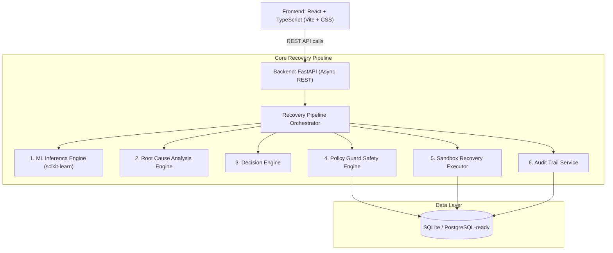

# RecoverAI
### AI Revenue Recovery — Recover revenue before it becomes lost revenue.

[](https://github.com/harshi-codes/RecoverAI)
[](https://www.python.org/)
[](https://fastapi.tiangolo.com/)
[](https://react.dev/)
[](https://www.typescriptlang.org/)
[](https://scikit-learn.org/)
[](#14-testing--verification)

> **Razorpay AI Buildathon 2026** — *Track 03: AI Revenue Recovery*

---

## What is RecoverAI?

Failed payments are not necessarily lost revenue. **RecoverAI** is an AI-powered revenue recovery decision and control layer that identifies which failed-payment opportunities are worth pursuing, predicts their recoverability, diagnoses the failure cause, chooses a bounded intervention, enforces deterministic safety policies, and records the final outcome in an append-only audit log.

**RecoverAI does NOT simply retry every failed payment.** Instead, it enforces strict separation of responsibilities:

| Subsystem | Core Responsibility |
| :--- | :--- |
| **ML Model** | **Predicts** probability of successful recovery |
| **RCA Engine** | **Diagnoses** underlying root cause of failure |
| **Decision Engine** | **Decides** optimal bounded recovery intervention |
| **Policy Guard** | **Controls** & blocks unsafe or uncompliant actions |
| **Sandbox Executor** | **Acts** by simulating approved recovery workflows |
| **Audit Log** | **Records** immutable decision and execution history |

> [!NOTE]
> **Sandbox / Simulation Disclaimer**: All recovery executions performed by RecoverAI are executed in a simulated sandbox environment. **No real customer cards or bank accounts are ever charged.**

---

## 1. Problem

Payment failures occur for many distinct reasons—insufficient funds, network timeouts, bank downtime, expired cards, or customer drop-offs during 3DS authentication.

A raw payment failure code alone does not answer critical operational questions:
- *Is this payment actually recoverable?*
- *Why did it fail?*
- *Should we retry automatically, send a payment link, or offer a grace period?*
- *Is customer intervention safe, or has the customer opted out of communications?*
- *Have we reached maximum contact frequency limits for this user?*
- *Does the recovery amount exceed safety thresholds requiring human sign-off?*
- *Has the payment already succeeded out-of-band (e.g., via a manual retry)?*

Naively retrying every failed transaction leads to:
1. **Wasted recovery budget** on unrecoverable payment failures.
2. **Customer friction** from spammy reminders and notifications.
3. **Double charging risk** by retrying transactions that already succeeded.
4. **Policy violations** by ignoring customer opt-outs or daily contact limits.
5. **Lack of risk controls** by treating a ₹500 micro-transaction the same as a ₹75,000 enterprise invoice.

---

## 2. Solution

RecoverAI operates as a closed-loop recovery workflow that balances AI intelligence with deterministic safety.

```
                  ┌────────────────────────┐
                  │  FAILED PAYMENT EVENT  │
                  └───────────┬────────────┘
                              │
                              ▼
                        ┌───────────┐
                        │  DETECT   │ Revenue at Risk
                        └─────┬─────┘
                              │
                              ▼
                        ┌───────────┐
                        │  PREDICT  │ ML Recovery Probability Score
                        └─────┬─────┘
                              │
                              ▼
                        ┌───────────┐
                        │ DIAGNOSE  │ Root Cause Analysis (RCA)
                        └─────┬─────┘
                              │
                              ▼
                        ┌───────────┐
                        │  DECIDE   │ Recommended Bounded Action
                        └─────┬─────┘
                              │
                              ▼
                        ┌───────────┐
                        │   GUARD   │ Policy Guard Safety Evaluation
                        └─────┬─────┘
                              │
             ┌────────────────┴────────────────┐
             │                                 │
             ▼                                 ▼
   [ Policy Approved ]               [ Policy Blocked ]
             │                                 │
             ▼                                 ▼
   ┌───────────────────┐             ┌───────────────────┐
   │ SANDBOX EXECUTOR  │             │   ACTION BLOCKED  │
   └─────────┬─────────┘             └─────────┬─────────┘
             │                                 │
             └────────────────┬────────────────┘
                              │
                              ▼
                        ┌───────────┐
                        │   AUDIT   │ Append-Only Event Trail
                        └───────────┘
```

### Stage Responsibility Matrix

| Stage | Responsibility |
| :--- | :--- |
| **Detect** | Identifies payment failure events and quantifies revenue at risk |
| **Predict** | Machine Learning model computes recovery probability ($0.00 - 1.00$) |
| **Diagnose** | Deterministic RCA maps raw failure codes to failure categories and severity |
| **Decide** | Decision Engine selects optimal bounded action (smart retry, link, human escalation) |
| **Guard** | Policy Guard evaluates deterministic compliance rules (opt-outs, limits, amounts) |
| **Recover** | Sandbox executor executes approved recovery workflow safely |
| **Audit** | Appends full execution state, rule evaluations, and outcomes to audit log |

---

## 3. Architecture

RecoverAI is built on a clean, decoupled architecture separating presentation, API, decision intelligence, safety control, and data persistence.



### Key Technical Characteristics
- **Async Database Stack**: SQLAlchemy 2.0 async engine with `aiosqlite` for fast local development and `asyncpg` compatibility for production PostgreSQL deployment.
- **Database Migrations**: Alembic version-controlled database schemas (`backend/alembic/versions/`).
- **RESTful API Contract**: Pydantic schemas validating all inputs/outputs with strict type safety.
- **Isolated ML Artifacts**: Pre-trained `GradientBoostingClassifier` model artifacts loaded on backend startup.

---

## 4. End-to-End Workflow

1. **Step 1 — Detect**: A payment failure webhook or event creates a `recovery_case` tracking the revenue at risk.
2. **Step 2 — Predict**: 20 engineered payment, customer, and temporal features are passed to the ML model, returning a recovery probability (e.g., `0.9049`).
3. **Step 3 — Diagnose**: RCA analyzes the failure code (`NETWORK_ERROR`, `USER_DROP`, `BANK_BLOCK`, etc.) and determines recovery severity.
4. **Step 4 — Decide**: The Decision Engine maps probability and RCA to a bounded recovery action (e.g., `smart_retry_24h`, `send_payment_link`, `escalate_human`, or `no_action`).
5. **Step 5 — Policy Guard**: Deterministic policy rules evaluate safety constraint conditions:
   - *Customer Opt-out check*
   - *Maximum contact frequency check*
   - *Payment already captured / paid check*
   - *High-value amount threshold check (> ₹50,000)*
   - *Minimum ML recovery probability threshold check (< 60%)*
6. **Step 6 — Execute**: Approved cases enter the Sandbox Executor. Simulated webhooks transition status to `recovered`, `failed`, or `in_progress`.
7. **Step 7 — Record**: All pipeline evaluations, policy rule checks, and execution results are saved to an append-only `audit_log` trail.

---

## 5. ML Model

The recovery probability model predicts the **likelihood that a failed payment can be successfully recovered**.

> [!IMPORTANT]
> **Separation of Concerns**: The ML model *only* predicts probability. It has **no authority** to trigger payments or override safety policies.

### Verified Model Metrics

The model was trained and evaluated on 12,000 payment recovery samples:

| Metric | Verified Value | Description |
| :--- | :--- | :--- |
| **Algorithm** | `GradientBoostingClassifier` | Ensemble tree-based classifier |
| **ROC-AUC** | **0.8575** | Discriminative power score |
| **Precision** | **0.704** | Accuracy of positive recovery predictions |
| **Recall** | **0.461** | Coverage of total recoverable payments |
| **Accuracy** | **0.850** | Overall classification accuracy |
| **Total Dataset** | **12,000** | Synthetic merchant payment transactions |
| **Train Set** | **9,600** (80%) | Training split samples |
| **Test Set** | **2,400** (20%) | Test evaluation split samples |
| **Features** | **20** | Engineered features across 4 categories |
| **Positive Rate** | **35.8%** | Baseline recovery target distribution |

### Feature Importance Summary
1. `failure_code_NETWORK_ERROR` (26.55%) — Network failures yield the highest recovery potential.
2. `customer_previous_success_rate` (11.61%) — Historical customer payment reliability.
3. `retry_count` (10.98%) — Prior failed recovery attempts reduce probability.
4. `num_previous_failures` (8.79%) — History of customer payment issues.
5. `amount` (7.69%) — Transaction magnitude impact.

---

## 6. Policy Guard & Safety

Policy Guard acts as a **deterministic safety firewall** around the AI Decision Engine.

```
                    ┌────────────────────────┐
                    │   DECISION RECOMMENDATION   │
                    └───────────┬────────────┘
                                │
                                ▼
         ┌────────────────────────────────────────────────┐
         │                  POLICY GUARD                  │
         │                                                │
         │  Rule 1: Payment Succeeded? (Status=captured)  │
         │  Rule 2: Customer Opted Out? (opted_out=True)  │
         │  Rule 3: Contact Limit Exceeded? (count >= 3)  │
         │  Rule 4: Low ML Prob? (probability < 0.60)     │
         │  Rule 5: High Value Threshold? (amount >50k)   │
         └──────────────────────┬─────────────────────────┘
                                │
                 ┌──────────────┴──────────────┐
                 ▼                             ▼
        [ All Rules Pass ]           [ Violation Detected ]
                 │                             │
                 ▼                             ▼
        ALLOW EXECUTION                BLOCK / HUMAN APPROVAL
```

### Safety Rules Enforced
1. **Already Succeeded Rule (`payment_succeeded`)**: Prevents duplicate recovery attempts if a payment was already captured out-of-band.
2. **Opt-Out Compliance Rule (`opted_out`)**: Immediately blocks recovery communications if a customer has opted out.
3. **Contact Limit Rule (`contact_limit`)**: Blocks outreach if a customer has been contacted $\ge 3$ times for recovery.
4. **Low Probability Rule (`low_probability`)**: Blocks automated recovery if ML recovery probability is below $60\%$.
5. **High Value Safety Threshold (`high_amount`)**: Requires explicit human approval for transactions above ₹50,000.

---

## 7. Demo Scenarios

RecoverAI includes six deterministic demo scenarios accessible via the backend API and frontend:

| Scenario | Amount | Failure Code | ML Prob | Policy Guard Result | Final Outcome |
| :---: | :---: | :---: | :---: | :---: | :---: |
| **A** | ₹8,499 | `NETWORK_ERROR` | **90.49%** | `Approved` | **Recovered ₹8,499** |
| **B** | ₹1,299 | `PAYMENT_FAILED` | **2.50%** | `Blocked` (`low_probability`) | **Blocked** |
| **C** | ₹75,000 | `NETWORK_ERROR` | **90.00%** | `Requires Human` (`high_amount`) | **In Progress (Human Pending)** |
| **D** | ₹2,999 | `USER_DROP` | **10.30%** | `Blocked` (`contact_limit`) | **Blocked** |
| **E** | ₹4,599 | `BANK_BLOCK` | **6.20%** | `Blocked` (`opted_out`) | **Blocked** |
| **F** | ₹6,299 | `NETWORK_ERROR` | **87.24%** | `Blocked` (`payment_succeeded`) | **Blocked (Idempotency)** |

### Operational Significance
- **Scenario A** demonstrates autonomous end-to-end sandbox recovery for high-confidence network errors.
- **Scenario C** demonstrates human-in-the-loop safety for high-value enterprise transactions.
- **Scenario F** demonstrates idempotency, preventing double charging when a payment is already captured.
- **Scenarios B, D, E** demonstrate strict policy enforcement against low probability, excessive contact, and opt-out violations.

---

## 8. Dashboard / Recovery Metrics

Live backend recovery metrics computed from aggregate database records (`GET /api/v1/recovery/stats`):

| Dashboard Metric | Verified Database Value | Metric Definition |
| :--- | :--- | :--- |
| **Revenue at Risk** | **₹205,581,411.50** (₹20.55Cr) | Total monetary value of all failed payment recovery cases |
| **Recoverable Revenue** | **₹130,509,657.02** (₹13.05Cr) | Sum of payment amounts where ML recovery probability $\ge 0.60$ |
| **Actionable Opportunities** | **₹77,756,983.55** (₹7.78Cr) | Total value of policy-approved recovery opportunities |
| **Recovered Revenue** | **₹73,686,862.69** (₹7.37Cr) | Total actual monetary value recovered from successful executions |
| **Recovery Rate** | **35.84%** | Realized recovery percentage ($\text{Recovered} \div \text{At Risk} \times 100$) |
| **Total Recovery Cases** | **12,010** | Total cases processed by the platform |

---

## 9. Decision Trace / Auditability

Every recovery decision in RecoverAI is fully transparent and auditable.

```
DETECT ──> SCORE ──> DIAGNOSE ──> DECIDE ──> POLICY ──> EXECUTE ──> OUTCOME
```

### Audit Trail Guarantees
- **Append-Only Event Log**: Audit records are stored in an append-only `audit_logs` database table.
- **Full Context Metadata**: Each audit log captures actor (`system` or `user`), entity type, timestamp, rule evaluations, and execution outputs.
- **Decision Trace Visualizer**: The frontend provides a step-by-step visual trace showing feature importances, RCA rules, policy rule outputs, and execution logs for every case.

---

## 10. Tech Stack

| Component | Technology | Description |
| :--- | :--- | :--- |
| **Backend Framework** | `FastAPI 0.110` | High-performance Python async REST API |
| **ML Engine** | `scikit-learn 1.4` | `GradientBoostingClassifier` model & pipelines |
| **ORM / Database** | `SQLAlchemy 2.0` | Async ORM (`aiosqlite` local, `asyncpg` production) |
| **Migrations** | `Alembic 1.13` | Database versioning & schema migrations |
| **Testing** | `pytest 9.1` | Asynchronous test suite (51/51 tests passing) |
| **Frontend Framework** | `React 18.3` + `TypeScript` | Modern single-page application |
| **Build Tooling** | `Vite 5.2` | Fast HMR frontend bundler |
| **Styling** | Vanilla CSS | Custom design system (`design-system.css`) |

---

## 11. Project Structure

```
recoverai/
├── backend/
│   ├── alembic/              # Database migration scripts
│   ├── app/
│   │   ├── api/              # REST API endpoints (recovery, ml)
│   │   ├── ml/               # Model inference, features & artifacts
│   │   ├── models/           # SQLAlchemy ORM database models
│   │   ├── schemas/          # Pydantic request/response schemas
│   │   ├── services/         # Pipeline, RCA, Policy, Executor & Audit services
│   │   └── tests/            # pytest test suite (51 tests)
│   ├── scripts/              # Seed scripts (seed_data, seed_demo_scenarios)
│   ├── pyproject.toml        # Backend configuration
│   └── requirements.txt      # Python dependencies
├── frontend/
│   ├── public/               # Static assets & icons
│   ├── src/
│   │   ├── api/              # API client integration (`client.ts`)
│   │   ├── components/       # DecisionTrace, ProbabilityRing UI components
│   │   ├── pages/            # Dashboard, Queue, CaseDetail, Policy, Model pages
│   │   └── styles/           # Custom design system CSS
│   ├── package.json          # Frontend dependencies & scripts
│   └── vite.config.ts        # Vite configuration
├── docs/
│   ├── ARCHITECTURE.md       # Technical architecture specification
│   └── DEMO_SCRIPT.md        # Step-by-step 5-minute judge demo guide
├── .gitignore                # Environment & build exclusions
├── package.json              # Workspace script runner
└── README.md                 # Project README documentation
```

---

## 12. Local Setup

### Prerequisites
- **Python**: `3.10+` (Python 3.13 recommended)
- **Node.js**: `18+` & `npm`

### Step 1: Clone Repository
```bash
git clone https://github.com/harshi-codes/RecoverAI.git
cd RecoverAI
```

### Step 2: Backend Setup
```bash
cd backend
python3 -m venv .venv
source .venv/bin/activate
pip install -r requirements.txt
cp .env.example .env
```

### Step 3: Database & Seed Data
```bash
# Seed 12,000 cases + train ML model + seed 6 demo scenarios
python3 scripts/seed_data.py
python3 scripts/seed_demo_scenarios.py
```

### Step 4: Start Backend API
```bash
python3 -m uvicorn app.main:app --port 8000 --reload
```
*Backend will run at `http://127.0.0.1:8000` (API Docs at `http://127.0.0.1:8000/docs`).*

### Step 5: Frontend Setup & Run
In a new terminal window:
```bash
cd frontend
npm install
npm run dev
```
*Frontend will run at `http://localhost:5173`.*

---

## 13. API Overview

| Method | Endpoint Path | Summary / Purpose |
| :---: | :--- | :--- |
| `POST` | `/api/v1/recovery/analyze/{payment_id}` | Runs full recovery pipeline for a payment (Idempotent) |
| `GET` | `/api/v1/recovery/cases` | Paginated list of recovery cases with filters |
| `GET` | `/api/v1/recovery/cases/{case_id}` | Detailed case payload (Case, Payment, ML, RCA, Audit) |
| `POST` | `/api/v1/recovery/cases/{case_id}/approve` | Human approval endpoint for pending high-value cases |
| `POST` | `/api/v1/recovery/cases/{case_id}/reject` | Human rejection endpoint for pending high-value cases |
| `GET` | `/api/v1/recovery/stats` | Dashboard aggregated revenue recovery metrics |
| `POST` | `/api/v1/demo/reset` | Resets all 6 demo scenarios to clean state |
| `GET` | `/api/v1/ml/info` | ML model metadata, metrics, and feature importances |

---

## 14. Testing & Verification

The project includes an extensive automated backend test suite verifying core recovery logic, safety policies, RCA mappings, and idempotency.

```bash
cd backend
python3 -m pytest app/tests/ -v
```

### Test Coverage Results (**51 / 51 PASSED**)
- **Policy Guard Tests** (`test_policy.py`): 24 tests verifying opt-out, contact limits, high amounts, low probabilities, and rule priorities.
- **Pipeline Integration Tests** (`test_pipeline.py`): 10 tests verifying scenarios A-F and audit logging.
- **RCA Tests** (`test_rca.py`): 13 tests verifying failure code mappings and severity escalations.
- **Idempotency Tests** (`test_idempotency.py`): 4 tests verifying duplicate prevention and safe re-runs.

### Frontend Production Build Verification
```bash
cd frontend
npm run build
```
*Built cleanly with **0 errors** and **0 warnings**.*

---

## 15. Design / Product

RecoverAI features a modern fintech operations interface designed after Stripe Dashboard and Linear.

### Key Screens
- **Dashboard**: High-level revenue metrics, recovery funnel, and top failure breakdown.
- **Recovery Queue**: Filterable list of recovery cases with probability badges and policy states.
- **Case Detail**: Comprehensive single-case inspection view with interactive Decision Trace.
- **Policy & Safety Center**: Control panel displaying active policy rules and violation logs.
- **Model Info**: Model card with performance metrics (ROC-AUC 0.8575) and feature importance charts.

---

## 16. Build Challenges

| Challenge | Architectural Solution |
| :--- | :--- |
| **Separating AI predictions from safe execution** | Decoupled ML inference from Policy Guard; ML outputs probability, while Policy Guard holds absolute veto power. |
| **Safely handling high-value enterprise transactions** | Implemented a `high_amount` threshold (> ₹50,000) that forces cases into `requires_human` approval mode. |
| **Preventing duplicate retries & double charges** | Built strict idempotency checks in both Policy Guard (`payment_succeeded`) and the pipeline runner. |
| **Consistent metric definitions across UI & API** | Standardized math formulas in `GET /api/v1/recovery/stats` so Recovered Revenue never exceeds Recoverable Revenue. |
| **Testing recovery without charging real accounts** | Built a Sandbox Executor module simulating payment gateway webhook responses. |

---

## 17. Limitations & Future Work

- **Sandbox Execution**: Current execution relies on simulated webhook responses. Production deployment would require direct integration with Razorpay Webhooks and APIs.
- **Synthetic Training Data**: ML model was trained on simulated merchant transactions. Real-world deployment requires continuous retraining on actual merchant outcome data.
- **Policy Calibration**: Safety thresholds (e.g., ₹50,000 ceiling, 3-contact limit) are currently static defaults and would need per-merchant customization.

---

## 18. Buildathon Alignment

### Track 03: AI Revenue Recovery
RecoverAI directly addresses the core objective of Track 03 by:
1. Turning payment failure data into actionable recovery opportunities.
2. Replacing blind retries with intelligent, failure-specific recovery actions.
3. Enforcing strict safety policies to protect customer trust and merchant compliance.
4. Providing full auditability and human-in-the-loop control for high-risk transactions.

---

## 19. Demo

Follow this 5-minute walkthrough to experience RecoverAI:

1. **Dashboard**: View overall **Revenue at Risk** (₹20.55Cr) and **Recovered Revenue** (₹7.37Cr).
2. **Recovery Queue**: Open **Demo Scenario A** (`₹8,499 NETWORK_ERROR`).
3. **Case Detail**: Observe ML score (**90.49%**), RCA diagnosis, Policy Approval, and Sandbox Recovery.
4. **Demo Scenario C**: Inspect high-value case (`₹75,000`), notice `requires_human` state, and click **Approve Case**.
5. **Demo Scenarios B, D, E, F**: Verify how low probability, contact limits, opt-outs, and idempotency block execution.
6. **Policy & Safety View**: Review active policy guardrails.
7. **Model Info**: View ML performance metrics and feature importances.

> *For the complete script, see [docs/DEMO_SCRIPT.md](docs/DEMO_SCRIPT.md).*

---

## 20. Credits & Submission

Built for the **Razorpay AI Buildathon 2026**.

- **Repository**: [github.com/harshi-codes/RecoverAI](https://github.com/harshi-codes/RecoverAI)
- **Track**: *Track 03 — AI Revenue Recovery*
- **License**: MIT
